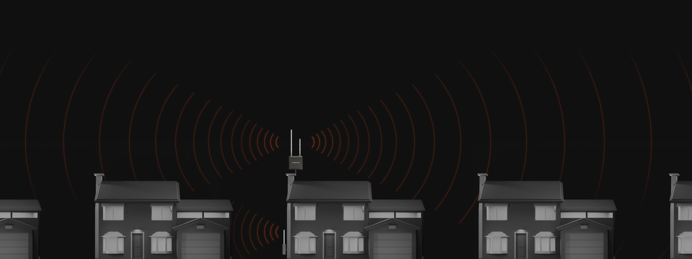

# Importance of Antenna Placement for Coverage Signal and Crypto Rewards

When it comes to optimizing the coverage signal and maximizing your crypto rewards as a network keeper, the placement of your miner's antenna takes center stage. The impact of proper antenna placement cannot be underestimated; it directly influences the reach of your network coverage and the rewards you reap from your mining efforts.

## Understanding the Gateway and Its Purpose

A gateway, in the context of network coverage, stands as a robust telecom-grade outdoor equipment. Designed to weather various conditions, it's meant to extend comprehensive coverage to your vicinity, entire neighborhoods and cities. However, this coverage potential hinges significantly on how well you position your gateway's antenna.

## Signal Path and Obstacles

The essence of gateway positioning is to ensure a clear and unhindered signal path. As illustrated, the signal's trajectory encounters obstacles – trees, buildings, mountains, and the like – which can obstruct, weaken, or entirely block its course. Proper placement aims to minimize these disruptions and maximize signal transmission.

## Wall Placement and Signal Limitations

Consider placing your gateway on a wall? While this might seem convenient, it inadvertently acts as a signal blocker, directing the signal primarily in one direction until it encounters another obstacle. The wall itself becomes an obstacle, curtailing the reach of the signal and its coverage potential.

## Optimal Antenna Placement – Rooftop Advantage

Elevating the antenna to the highest point of your roof holds immense significance. By doing so, you effectively eliminate obstacles that can hinder signal propagation. Your antenna rises above the height of trees and buildings, ensuring that the signal covers a significantly larger area with minimal interruptions.

## Impact on Mining Rewards

Antenna placement not only influences coverage but also directly impacts your mining rewards. Placing the antenna at a lower level or against a building wall restricts its signal reach due to inherent obstacles. This impedes the antenna's ability to establish connections with other antennas in the vicinity, which is crucial for maximizing rewards.

## The Significance of Pinging

In the context of network connectivity, "pinging" refers to antennas communicating with each other via the radio signal (chirps). This interaction plays a vital role in the crypto rewards you receive. While rewards are granted for placing an antenna, additional rewards are earned when your antenna successfully pings another. Proper antenna placement directly enhances the probability of such interactions, thereby boosting your potential rewards.
