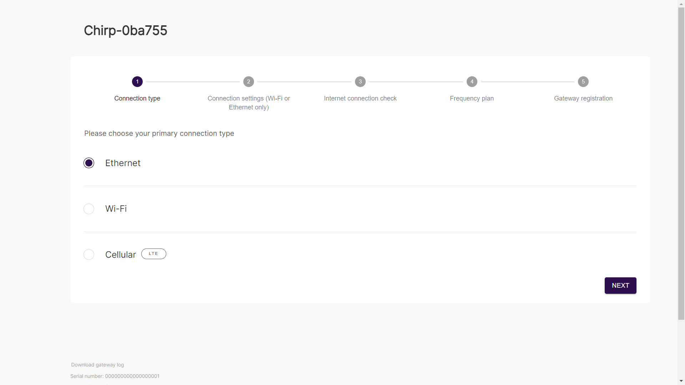
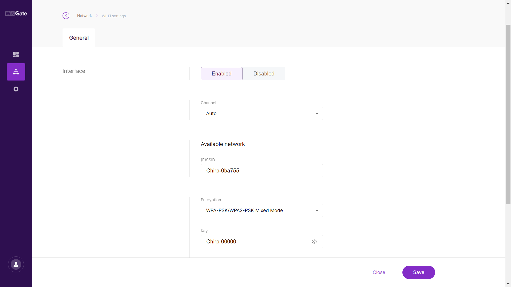
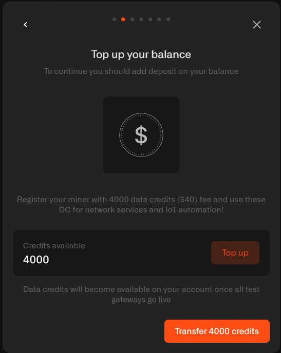
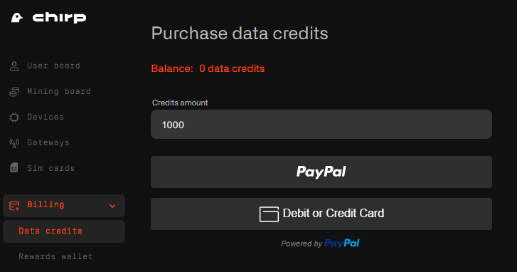
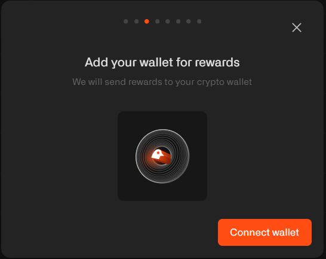
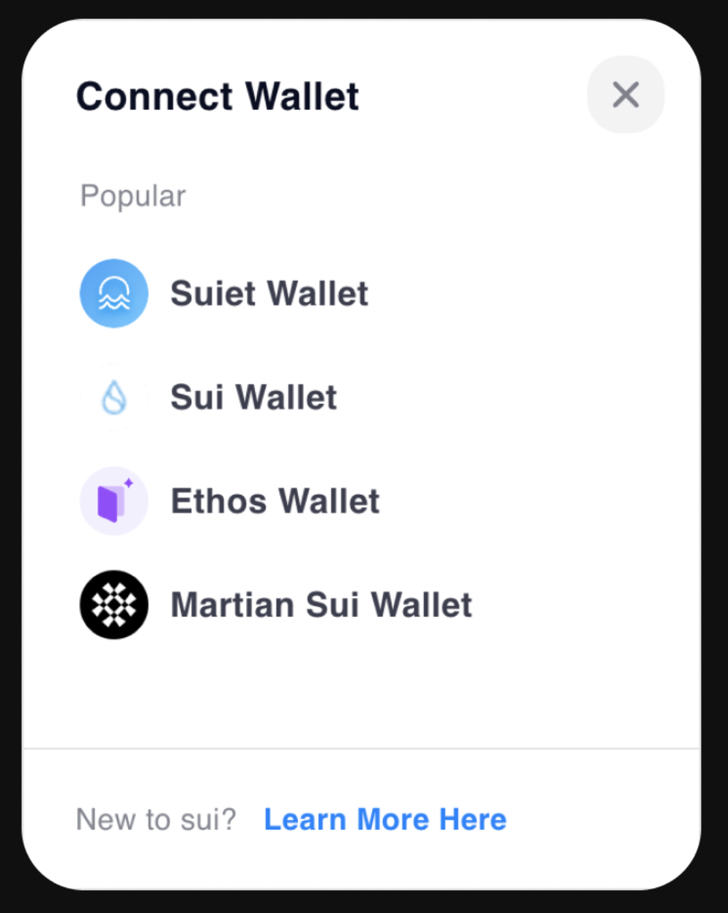
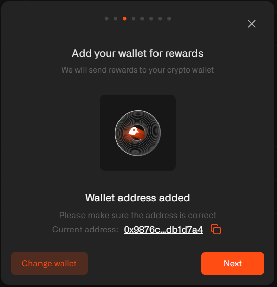
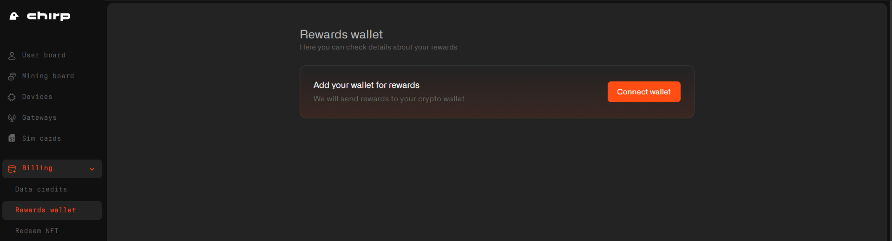
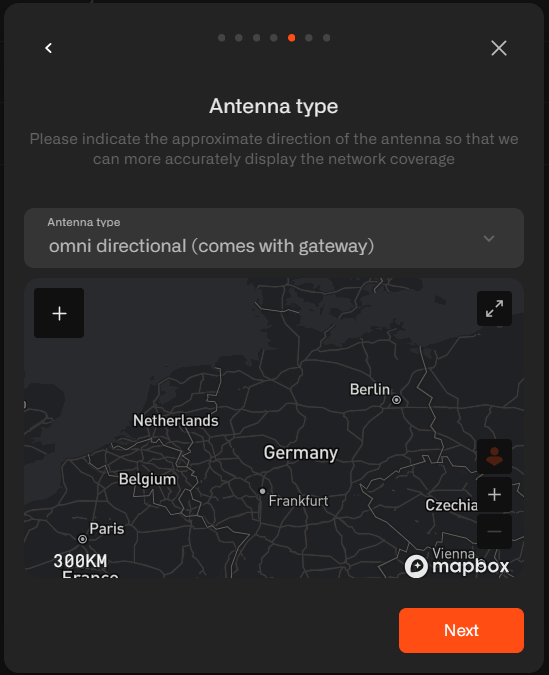
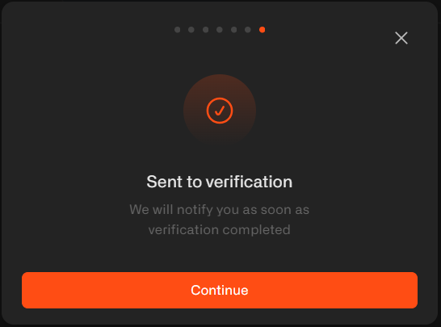

# Blackbird Registration

## Step One (Connect to the Gateway's Wi-Fi Access Point)

After properly mounting your gateway, take your smartphone and open the "Wi-Fi Connections". If the gateway is powered on, you will see a Wi-Fi access point named "Chirp-XXXXXX" (XXXXXX represents gateway-specific numbers). Connect your phone to this access point. **Password is the same as the access point name Chirp-XXXXXX**.

It is strongly recommended to stay close to the gateway (around 5 meters) during the registration process to ensure a stable connection.

## Step Two (Open the Gateway's Access Point in Your Browser)

Once successfully connected to the gateway's Wi-Fi access point, open your internet browser and type the following IP address in the address bar: **192.168.230.1**

## Step Three (Create a Password for Your Gateway)

You will be prompted to create a password for your gateway. Enter password twice and click "Set password".

.png>)

## Step Four (Select the Gateway's Primary Connection Type to the Internet)

On the next screen, select the gateway's primary connection type to the internet. For these instructions, we will choose Ethernet. Click "Next".

## Step Five (Configure the Gateway's Connection to the Internet)

If you want to assign a static IP address or customize DNS fields, you can do so on this screen. If you are unsure about these settings, keep default and simply click "Save".

.png>)

## Step Six (Check the Internet Connection)

The gateway will confirm the internet connection. Click "Next".

.png>)

.png>)

## Step Seven (Select Country and Region)

On the next screen, select your country and LoRaWAN region. Click "Confirm" and then click "Save".

.png>)

.png>)

.png>)

## Step Eight (Register the Gateway)

This is the final step of registration through the gateway's access point. On this screen, you have the option to change the password for the gateway's access point "Chirp-XXXXXX" to enhance security. We recommend you change the password by following link "Go to Wi-Fi settings". Set new password and click "Save".

After changing the password open the Dashboard and click "Register". You will be redirected to the login screen of the Chirp's Dashboard.

## Step Nine (Log into Your Chirp's Dashboard Account)​

Log into your Chirp's Dashboard account, you already have it (this is where you redeemed your NFT).

## Step Ten (Name Your Gateway)

After signing in, you will be prompted to name your gateway for your convenience. This allows you to differentiate between multiple gateway, such as Berlin Gateway, Washington Gateway, etc.

## Step Eleven (Enrollment Fee)

Once your Chirp gateway is installed, the next step is to pay the enrollment fee of 4000 data credits ($40). This fee covers your data credits. These data credits will be transferred to your account and can be used for connectivity services. Please, see [here](../4-data-credits.md) for additional info.

_Note: Payment can be made through PayPal at Billing -> Data credits page._

## Step Twelve (Connect Sui Wallet)

Next you need to connect Sui wallet for rewards (i.e. Sui or Suiet) to Chirp platform. Click "Connect wallet".

Select your wallet.

Click "Next".

_Note: You can also connect reward wallet at Billing -> Rewards wallet page._

## Step Thirteen (Submit Pictures of the Gateway and its Installation)

Upload the pictures of the gateway and its installation that you took during the final step of gateway installation.

Press "Next". You will receive a message confirming the successful submission of the photos.

## Step Fourteen (Set Antennas Settings and Approximate Direction of Antenna)

Choose antenna\`s height counting from the ground level and click "Next".

Choose antenna's type and approximate direction on map and click "Next".

_Note: Please be honest in selecting the antenna height and orientation as it does not impact your rewards, but it is crucial for accurate calculation of the network coverage map._

Now, wait for the approval of your gateway registration. Click "Continue".

If you have questions regarding verification process please refer to requirements [page](7-verification.md).

Contact us via [`help@chirpwireless.io`](mailto:help@chirpwireless.io) for further assistance.

You will also receive an email associated with your account.

You can log into your dashboard to monitor the status of your installation approval.

## Step Fifteen (Adding a Device)

Before submitting your miner for verification, make sure to add a LoRaWAN device to the miner’s network. This step is essential for ensuring network connectivity and verifying device compatibility. For detailed instructions on adding a device, refer to [this guide](6-adding-device.md).
