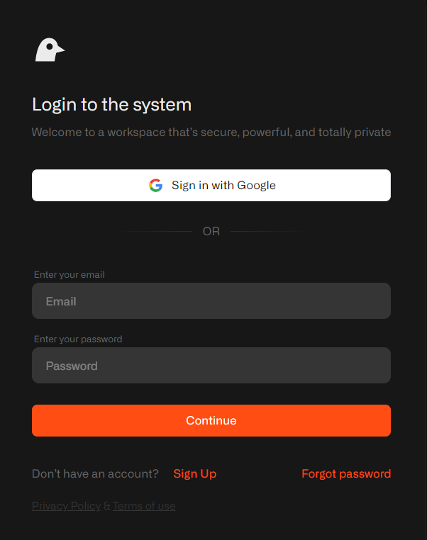
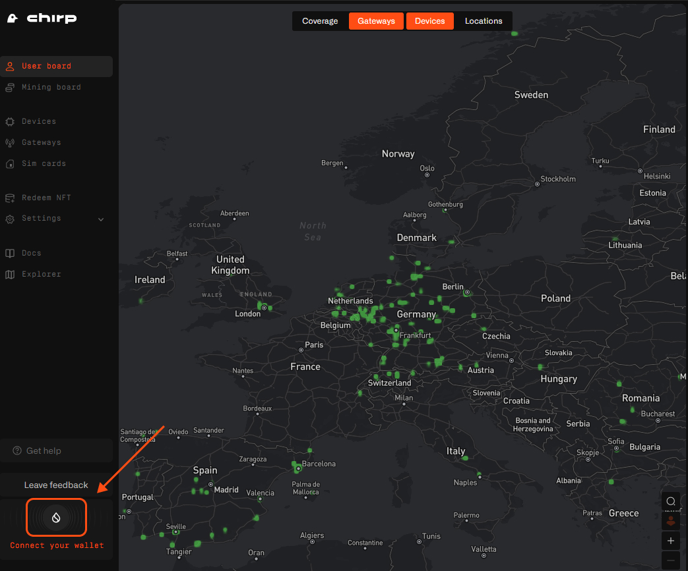
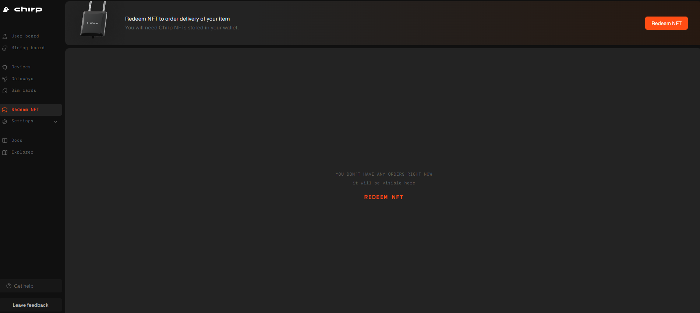
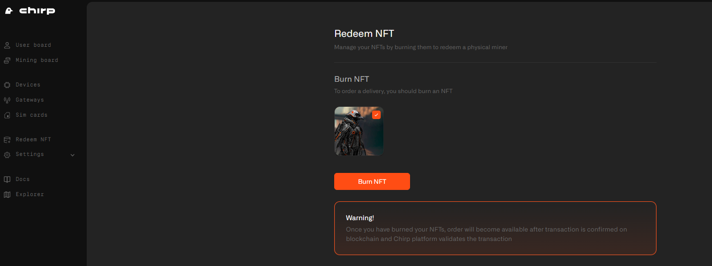
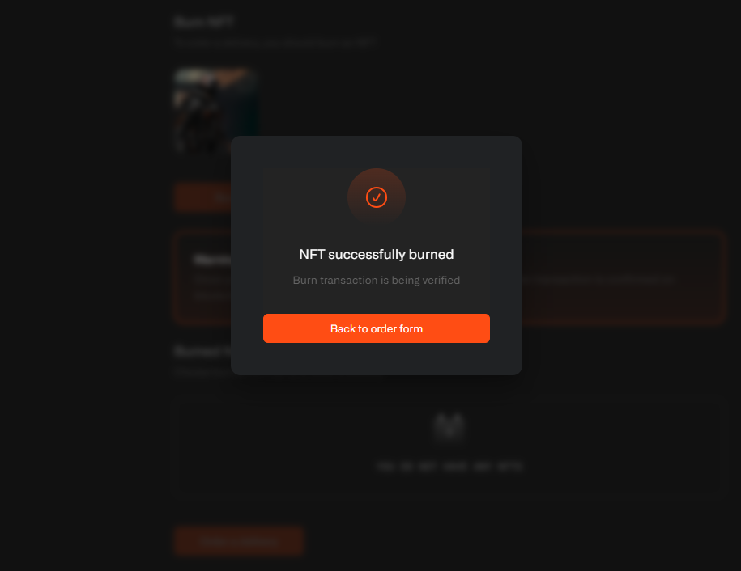
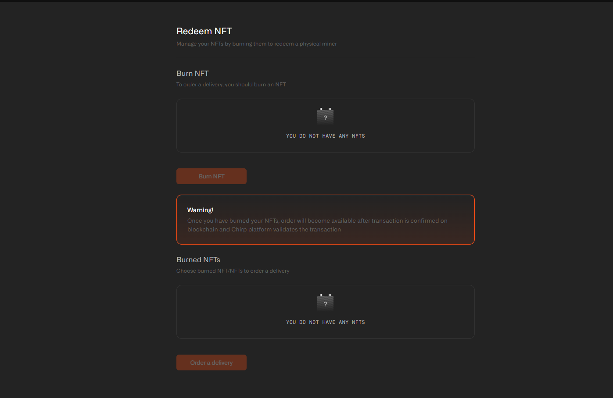
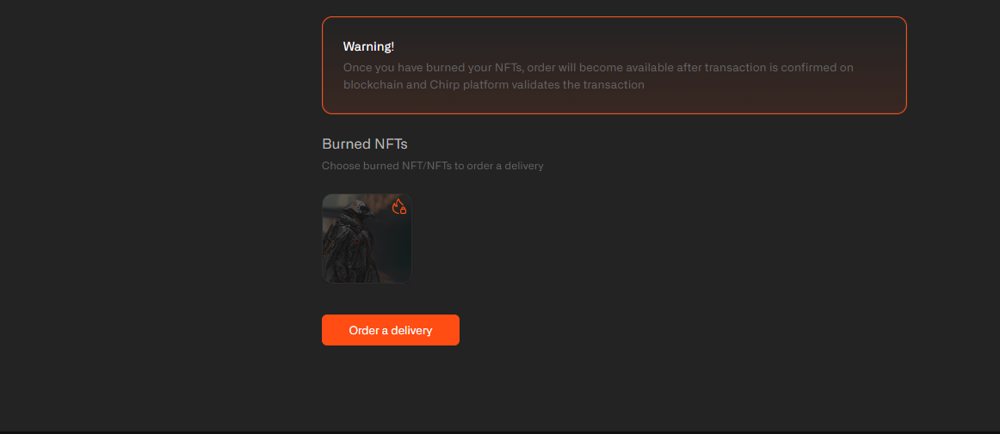
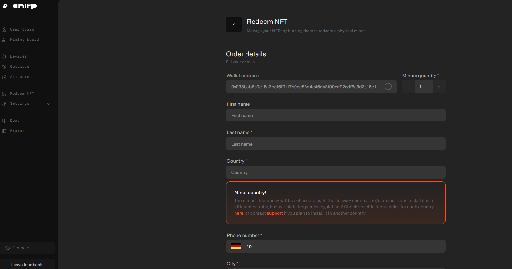
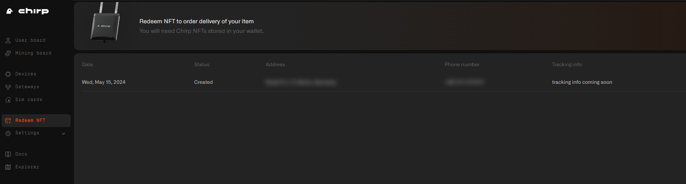

# Redeem NFT

## How to burn your Skyward Soarer NFT and Order a Blackbird miner on Chirp Platform?

For the best experience with the Skyward Soarer NFT burn process and the subsequent Blackbird miner order, it is highly recommended to use Suiet wallet or Sui wallet created using the classic method with a seed phrase. If your Skyward Soarer NFT is stored in a Sui wallet that was set up through Google or Twitch authorization, you will not be able to complete this process. In such a case, please contact our support team for assistance.

## Step One

Go to [https://app.chirpwireless.io](https://app.chirpwireless.io) and sign-in or sign-up (in case you don't have an account on Chirp).

## Step Two

Connect the Sui wallet where you have the Skyward Soarer NFT and approve all the actions in your wallet as well as on the Chirp Platform.

## Step Three

Go to Redeem NFT section and click on “Redeem NFT”

## Step Four

Burn your Skyward Soarer NFT and approve all the actions in your wallet. Once you have burned your NFTs, the order will become available after the transaction is confirmed on the blockchain and the Chirp platform validates the transaction.

**Important: The Skyward Soarer NFT gives its owners not only a Blackbird Miner, but also a Skyward NFT that will be sent after the Skyward Soarer NFT is burned.**

## Step Five

When the process is complete, you are ready to order your Blackbird miner. Just click on "Order a delivery."

## Step Six

Please fill in all the information very carefully and double-check everything before proceeding further. When ready, mark the checkbox to agree with the Privacy Policy and then click on "Proceed."

## Step Seven

Congratulations! The redeem and order process is complete. The shipment process starts immediately after the mainnet launch, and you will receive your Blackbird miners shortly thereafter.

You can track your delivery information at [https://app.chirpwireless.io/redeem-nft/orders](https://app.chirpwireless.io/redeem-nft/orders).

