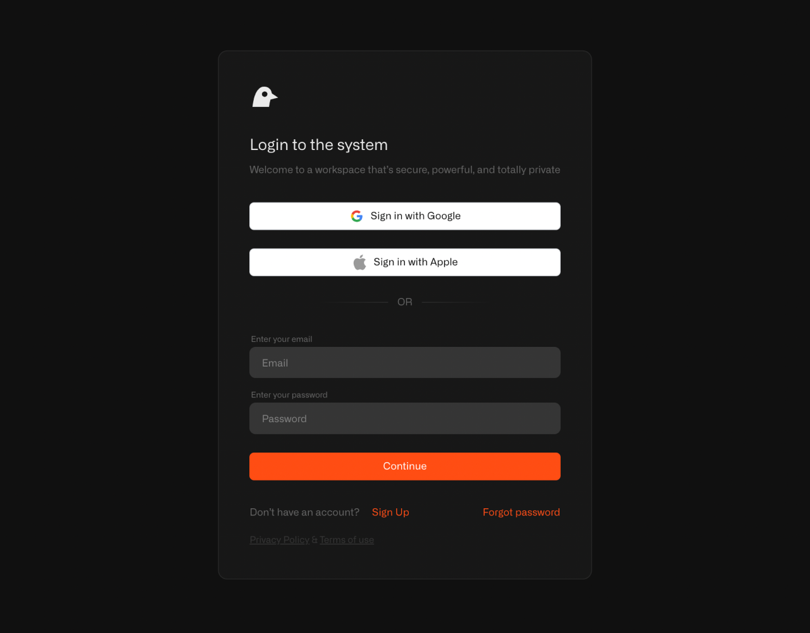
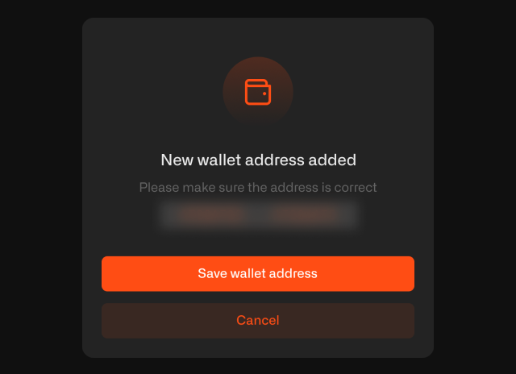
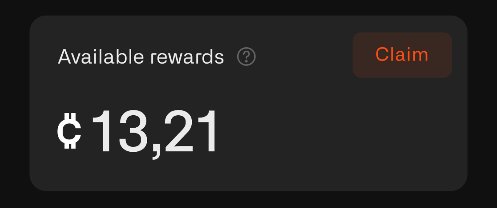

# Kage - Wallet and Rewards Claim

## How to Connect Your Wallet and Withdraw Tokens

To claim your Kage rewards, you need to connect your Sui wallet to the Chirp platform.

**Important**: Wallet connection, disconnection, and rewards claims are only available through the Sui extension on a desktop, as the Sui wallet can only be connected via the desktop version.

## Steps to Connect Your Wallet and Withdraw Tokens

### 1. Go to the Chirp platform

* On your computer, open Chrome browser.
* Go to [app.chirpwireless.io](https://app.chirpwireless.io).

### 2. Log in to your account using the same ID you use in the game

* Use the same username and password that you created when signing up for the Kage game.
* If you forgot your password, look for the "Forgot Password" link and follow the steps to reset it.

### 3. Connect your Sui wallet

* Once logged in, go to Wallet from the side menu.

<figure><figcaption></figcaption></figure>

* Click the **"Connect wallet"** button.

<figure><figcaption></figcaption></figure>

* You’ll be shown a range of wallets. Please choose the one that suits you. We recommend Sui and Suiet wallets. Then, confirm sharing your wallet address in the wallet app.

<figure><figcaption></figcaption></figure>

After this, you should see a message confirming that the wallet was successfully added. Next, you need to verify it. You will be redirected to Sui, where you should press the **"Sign"** button. Once this is done, the wallet will be added to your account on the Chirp platform and Kage game.

### 4. Check Claimable Rewards

After successfully connecting your wallet, go to the **User Board** page.

In the **General info** section, you’ll see the number of tokens available for claiming.

### 5. Withdraw tokens: Data Credits (DCs) and Locking

Before withdrawing your CHIRP tokens earned in Kage, make sure your Sui wallet has a small amount of SUI to cover network transaction fees.&#x20;

Claiming rewards also requires Data Credits, which are used to pay a small platform service fee. The fee is 1% of the CHIRP amount claimed, with a minimum of $0.10 and a maximum of $10.00, charged in Data Credits.

Data Credits are used for various Chirp services like SIM top-ups, platform fees, and reward claims. They are non-refundable and non-transferable, with a fixed value of **$0.01 USD per one DC**.

You can top up your Data Credits directly in your account settings using a card, PayPal, or cryptocurrency via NowPayments. To manage or refill your balance, go to: [ https://app.chirpwireless.io/settings/data-credits](https://app.chirpwireless.io/settings/data-credits).&#x20;

Be aware that your rewards are subject to a time-based locking mechanism. When rewards are first distributed they are fully locked, but are still available for early withdrawal with penalty applied.&#x20;

Penalty decreases over time:

* Immediately after distribution — 60% penalty, 40% available.
* After 1 month — penalty reduced to 40%, 60% available.
* After 2 months — penalty reduced to 26%, 74% available.
* After 3 months (45 epochs) — the penalty is removed, allowing you to withdraw 100% of rewards. Further rewards will also gradually unlock following the same logic.

## What happens next?

CHIRP tokens will be transferred to your Sui wallet, where you can hold onto them, use them for Chirp platform features, or eventually convert them through a cryptocurrency exchange.

## Need help?

If you're unsure about any of these steps, or if something isn't working, don't hesitate to reach out to Chirp's support team. We are here to help you every step of the way!
