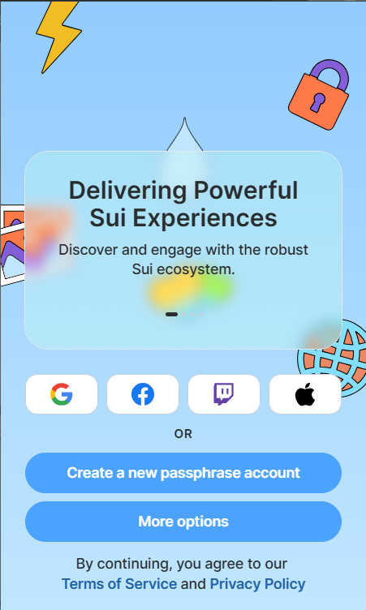

# Sui Wallet

To interact with the Chirp platform and be able to earn and further claim CHIRP rewards, you'll need to create and connect Sui wallet to Chirp.

## Sui Wallet Creation

Please bear in mind that currently Chirp platform supports these 4 Google chrome wallet extensions:

* [Suiet](https://chromewebstore.google.com/detail/suiet-sui-wallet/khpkpbbcccdmmclmpigdgddabeilkdpd)
* [Sui Wallet](https://chromewebstore.google.com/detail/sui-wallet/opcgpfmipidbgpenhmajoajpbobppdil)
* [Surf Wallet](https://chromewebstore.google.com/detail/surf-wallet/emeeapjkbcbpbpgaagfchmcgglmebnen)
* [Nightly](https://chromewebstore.google.com/detail/nightly/fiikommddbeccaoicoejoniammnalkfa)

So choose one of them to be able to interact with the Chirp platform. If you already use other wallets or platforms for interacting with Sui blockchain - visit our guideline on how to export your seed phrase.

To create a reward wallet, please install one of 4 Google Chrome extension wallets for Sui blockchain (i.e. Sui wallet). After installation is complete, create your personal Sui wallet. You can create it with your Google account, but for improved security we recommend using a method with the “passphrase”.

hen wallet is created check if the Mainnet is selected

<figure><figcaption></figcaption></figure>

<figure><figcaption></figcaption></figure>

<figure><figcaption></figcaption></figure>

## Sui Wallet Connection to Chirp

When your Sui wallet is set up please navigate to [https://app.chirpwireless.io](https://app.chirpwireless.io). Sign up if you are new to Chirp or sign in into your Chirp account. After, go to the Settings section in the menu, choose [Rewards wallet](https://app.chirpwireless.io/rewards-wallet) and click on Connect wallet button.

Select a wallet extension you have installed.

<figure><figcaption></figcaption></figure>

Next you need to choose the correct wallet address and click Connect.

<figure><figcaption></figcaption></figure>

Confirm wallet by clicking the Save wallet address button.

<figure><figcaption></figcaption></figure>

To verify a reward wallet, you need to sign message with your wallet, click Sign.

<figure><figcaption></figcaption></figure>

After that your rewards wallet is set and verified.

<figure><figcaption></figcaption></figure>

## Adding SUI to Your Wallet

When you are ready to claim your earned CHIRP tokens, it's essential to have a small balance of SUI in your wallet to cover the gas fees required for the transaction. Without SUI to pay for gas, the claim attempt will result in an error.

## Why Do You Need SUI?

Every transaction on the Sui network requires a small gas fee in SUI for successful completion. Even for claiming CHIRP tokens, gas is needed, so having at least a small amount of SUI in your wallet is a necessary requirement.

## How Much SUI is Needed?

A minimum of 0.1 SUI is required for most standard claim operations. It’s recommended to keep at least 1 SUI in your wallet to cover several transactions and avoid any potential issues.

## How to Purchase SUI

Buy SUI on Exchanges: You can purchase SUI tokens on popular cryptocurrency exchanges and transfer them to your wallet. Here are some recommended exchanges where you can buy SUI:

* Binance
* Coinbase
* Kraken

Please ensure you have a small balance of SUI in your wallet before claiming CHIRP tokens. This will guarantee a smooth transaction process and help you receive your rewards without any delays.
