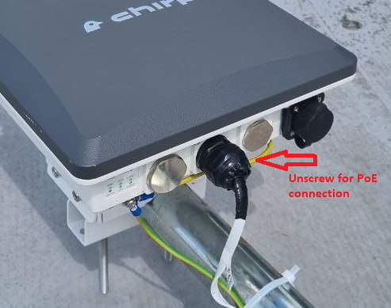
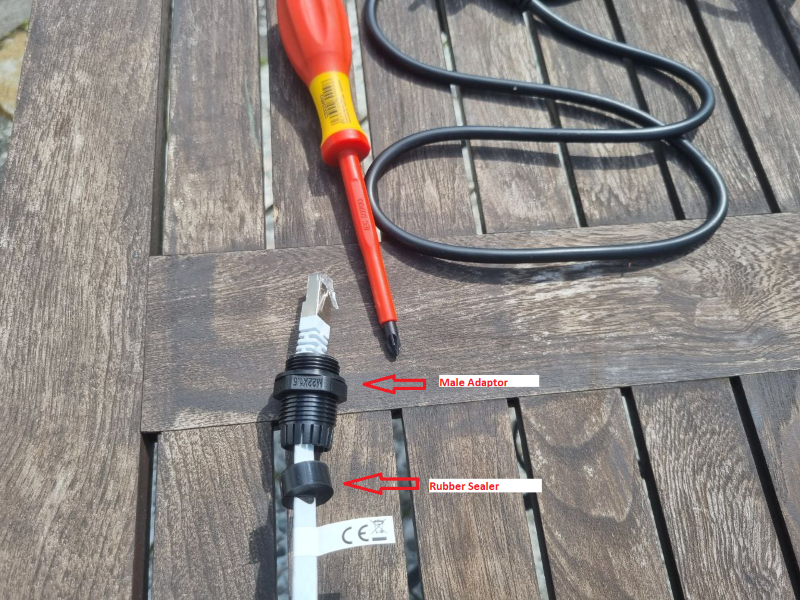
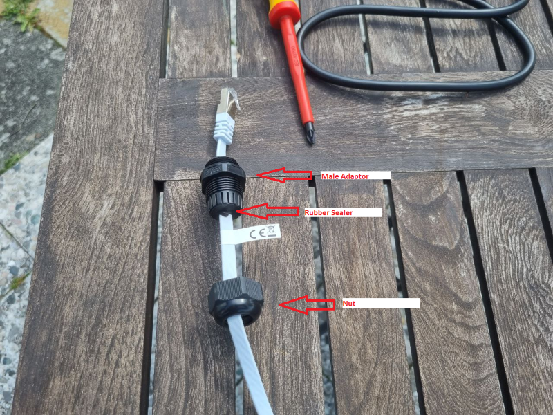

# Installation

## Please Ensure You Read Before Installation

**CAUTION**

Do not install your hotspot outdoors (on balconies, roofs, open spaces, poles, etc.) without lightning protection for the antennas and Ethernet cables (PoE).

Lightning strikes can damage hotspot components, and this is not covered by the warranty!

When powering the hotspot with DC power, ensure correct polarity and stay within the maximum voltage. Reversed connections or overvoltage can damage components and are not covered by the warranty.

**IMPORTANT**

For installation guides:

For surge protection, accessories, etc.:

**Please Note:**

Damages resulting from lightning strikes, incorrect power supply, or improper deployment are not covered by the warranty. We highly recommend using proper lightning protection and grounding!

Thank you for choosing the Chirp Wireless Gateway! Please follow these essential protection and setup practices for secure and long-lasting outdoor deployment.

### Grounding & Surge Protection

* **Proper Grounding:** Grounding is crucial to protect your gateway from electrical surges. Ensure a secure ground wire connects the gateway and antenna lightning arrestor to a grounding rod or nearby reliable grounding point.
* **Surge Protection Device (SPD):** Install a surge protector on the power line and Ethernet cable to prevent damage from sudden power spikes.

### Lightning Protection

* **Lightning Arrester:** Use a lightning arrester on the antenna cable as an additional layer of protection. This device should be installed between the antenna and the gateway, as close to the gateway as possible, and connected to the same grounding system.
* **Placement Precautions:** Avoid placing the gateway on high, isolated structures without proper lightning protection. Structures like tall poles or rooftops are especially vulnerable to lightning if not well-grounded.

### Power Supply & Cable Management

* **Cable Quality:** Outdoor cables should be UV-resistant and suitable for extended exposure to the elements. Choose high-quality cables rated for outdoor use to reduce the risk of degradation.
* **PoE (Power over Ethernet):** The Chirp Wireless Gateway supports PoE, allowing you to power the gateway through a single Ethernet cable. This setup reduces the number of exposed cables and simplifies installation.
* The Chirp Wireless Gateway also supports off-grid powering with the RAK Battery Plus. Make sure to use the original cables delivered with the product. Make sure to ground the Battery Plus and the Solar Panel mount.
* **Surge-Protected PoE Injector:** Use a Signal Surge Protective device for the LAN/Internet side of the PoE adapter. This adds a layer of security, especially in lightning-prone areas.
* **Cable Routing and Security:** Secure cables along the mounting structure using weather-resistant cable ties or clips to prevent movement and potential damage. Avoid loose cables that could wear or break due to wind or wildlife interference.

All needed surge protection devices, cables, and antennas can be found in the RAK web store: [https://store.rakwireless.com](https://store.rakwireless.com)

## Step One (Assemble the Gateway):

**IMPORTANT! Do not power on the gateway until the antennas are attached to avoid damaging the concentrators.**

To assemble the gateway, attach the antennas to the gateway, ensuring that the antenna frequency matches the gateway frequency. As gateway are high-quality, expensive equipment, it is highly recommended to protect them from lightning and static. It is strongly suggested to install type N lightning arresters (male to female) (not included) between the antennas and the gateway and ground the lightning arresters and the gateway.

## Step Two (Grounding)

Ground the Lightning Arresters and the gateway with a ground cable.

## Step Three (Attach the Antennas)

Attach the antennas, ensuring they match the frequency.

## Step Four (Mount the Gateway)

You are now ready to mount.

To maximize rewards, it is advisable to mount the gateway at the highest available point. By doing so, your gateway will offer optimal coverage and increase the likelihood of detecting and connecting with other gateways in the vicinity. This enhanced visibility and connectivity have the potential to generate higher rewards for your mining activities.

**When it comes to mounting a gateway, it's crucial to consider the placement of its connection. Ensure that the connection is not obstructed or in a location where you might be tempted to unplug it, even for a short period of time. It's important to maintain a consistent and uninterrupted connection for optimal mining performance. If the gateway goes offline, it can have a significant impact on your reward coefficient. Therefore, it is essential to prioritize a stable and reliable connection to maximize your mining rewards.**

When it comes to mounting the gateway, it's important to adhere to the guidelines for outdoor installations. Depending on the type of dwelling, specific rules apply:

### Single Family House

For single-family houses, only roof installations are permitted. This ensures optimal coverage and performance for the Chirp Wireless network. Make sure to choose a suitable location on the roof that provides a clear line of sight and minimizes obstructions.

 

### Apartment Complex

In an apartment complex, mounting the gateway is limited to balconies or outside windows. These areas offer the necessary accessibility and positioning for the gateway. It's important to find a suitable location that doesn't obstruct neighboring units and allows for a strong signal transmission.

By following these guidelines, you can ensure the proper installation and functioning of the Chirp Wireless gateway, maximizing its efficiency and performance.

For a window mount the following [mount](https://www.wifi-shop24.com/antenna-mount-window-frame-15cm-aluminium) can be used that does not require drilling. (Flat ethernet cable can be used for data and power)

## Step Five (Connect the Gateway)

To power up your Blackbird and establish an internet connection, follow these steps:

If your router supports Power over Ethernet (PoE), (typically marked as follows)

connecting your gateway is a breeze. You'll only need one network cable (not included) to go from your router to the gateway. Simply connect one end of the network cable to an available LAN port on your router and the other end to the gateway. This setup will provide both internet connectivity and power to your gateway efficiently. Your Blackbird consumes on average 5W of power.

PoE Adaptor (Router without PoE Support): In the event that your router does not support PoE, you can still power up your gateway using a PoE adaptor included in the package.

Here's how:

1. Connect one Ethernet cable from your router to the LAN port on the provided PoE adaptor.
2. Then, use another Ethernet cable to connect the PoE port on the adaptor to the gateway.

Completely unscrew the PoE plastic gland from the gateway.

Pull the network cable through the plastic gland in the following order. 1. Nut 2. Rubber sealer 3. Male adapter

For extra protection cover with electrical tape

Once connected you should see the LED lights on the bottom of the gateway turn on.
